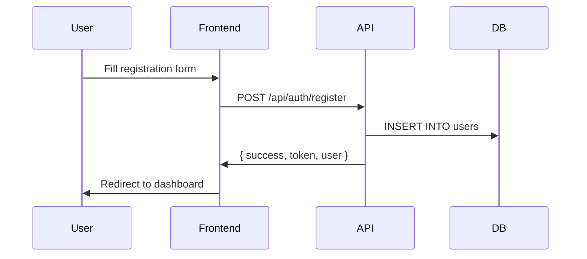
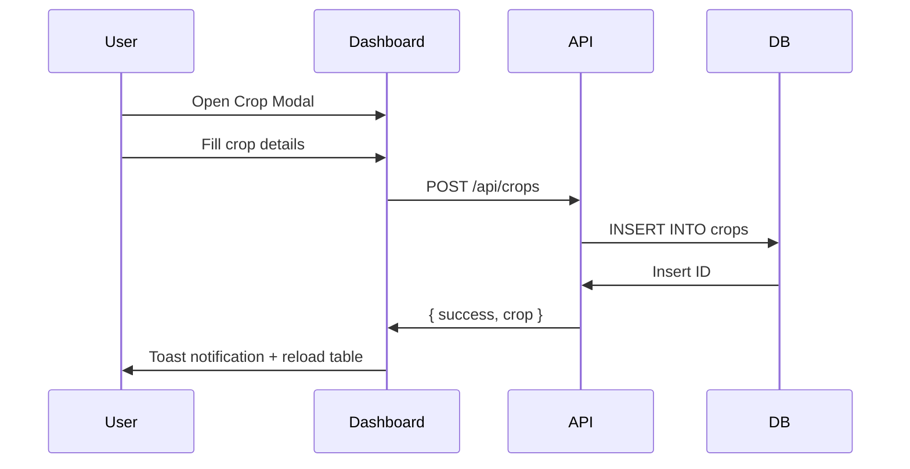
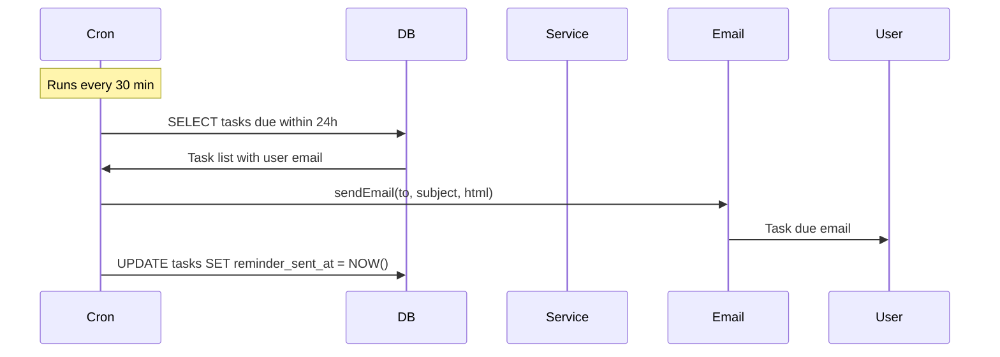

# KIBOE FarmSync — Complete Documentation

**Version:** 1.1.0  
**Last Updated:** August 2026  
**Tech Stack:** Node.js, Express, MySQL, HTML5, CSS3, Vanilla JavaScript

---

## Table of Contents

1. [System Overview](#1-system-overview)
2. [Architecture](#2-architecture)
3. [Data Flow Diagram](#3-data-flow-diagram)
4. [File Structure](#4-file-structure)
5. [Frontend Pages](#5-frontend-pages)
6. [Backend API](#6-backend-api)
7. [Database Schema](#7-database-schema)
8. [Authentication & Security](#8-authentication--security)
9. [Features by Module](#9-features-by-module)
10. [Installation & Setup](#10-installation--setup)
11. [Configuration](#11-configuration)
12. [Email & Notifications](#12-email--notifications)

---

## 1. System Overview

KIBOE FarmSync is a full-stack farm management platform designed for Kenyan farmers and agribusinesses. It provides tools to track crops, livestock, finances, supplies, tasks, and farm operations in one unified dashboard.

**Core Capabilities:**
- Crop management with planting/harvest tracking
- Livestock management with vaccination schedules and artificial insemination (breeding) records
- Financial tracking (income, expenses, profit analysis)
- Inventory and supplies management
- Task management with priority and reminders
- Calendar view of all farm events
- Weather integration (Open-Meteo API)
- Email notifications for password reset and reminders
- PDF and CSV report exports
- Role-based authentication (JWT)
- Marketplace — buy/sell farm produce and machinery (listings-only, contact via phone/WhatsApp/email)
- Agrovet Knowledge Centre — crop diseases, livestock diseases, farming guides, agrovet articles
- Agricultural events directory (upcoming/past)
- Contractors directory — tractor services, agrovets, transport
- Contractor panel — users can register as contractors, manage their own business listing, and post events
- Admin management panel — content moderation + knowledge centre management

---

## 2. Architecture

```
┌─────────────────────────────────────────────────────┐
│                   FRONTEND                           │
│  ┌──────────┐  ┌──────────┐  ┌───────────────────┐  │
│  │ index.html│  │ login    │  │   dashboard.html   │  │
│  │ landing   │  │ register │  │   (Single Page     │  │
│  │ page      │  │ .html    │  │    Application)    │  │
│  └──────────┘  └──────────┘  └───────────────────┘  │
│         │             │                │             │
│         └─────────────┴────────────────┘             │
│                         │ HTTP (Fetch API)            │
├─────────────────────────┼────────────────────────────┤
│                   BACKEND (Node.js/Express)           │
│  ┌──────────────────────┼────────────────────────┐   │
│  │              app.js  │  (Routes)              │   │
│  │  ┌──────────┐  ┌────┴────┐  ┌──────────┐     │   │
│  │  │  Auth    │  │  Crops  │  │Livestock │     │   │
│  │  │  Routes  │  │  Routes │  │ Routes   │     │   │
│  │  ├──────────┤  ├─────────┤  ├──────────┤     │   │
│  │  │Transact. │  │  Farm   │  │ Supplies │     │   │
│  │  │ Routes   │  │ Records │  │ Routes   │     │   │
│  │  ├──────────┤  ├─────────┤  ├──────────┤     │   │
│  │  │  Tasks   │  │Reports  │  │Password  │     │   │
│  │  │  Routes  │  │ Routes  │  │ Reset    │     │   │
│  │  └────┬─────┘  └────┬────┘  └────┬─────┘     │   │
│  │       │              │            │            │   │
│  │  ┌────┴──────────────┴────────────┴────┐      │   │
│  │  │         Controllers + Models        │      │   │
│  │  └────────────────┬───────────────────┘      │   │
│  └───────────────────┼──────────────────────────┘   │
│                      │                              │
│              ┌───────┴───────┐                      │
│              │   MySQL DB    │                      │
│              │  (mysql2/pool)│                      │
│              └───────────────┘                      │
└─────────────────────────────────────────────────────┘
```

**Pattern:** MVC (Model-View-Controller)  
**Frontend:** Server-rendered HTML + Vanilla JS (Fetch API for data)  
**Backend:** RESTful API with Express router  
**Database:** MySQL via mysql2/promise connection pool  

---

## 3. Data Flow Diagram

### Context Flow Diagram (Level 0)

```mermaid
graph TD
    USER([Farmer / User]) -->|Login / Register| AUTH[Authentication System]
    USER -->|Manage Crops| CROP[Crop Module]
    USER -->|Manage Livestock| LVSTK[Livestock Module]
    USER -->|Record Transactions| TXN[Finance Module]
    USER -->|Manage Supplies| SUP[Supplies Module]
    USER -->|Create Tasks| TASK[Task Module]
    USER -->|View Reports| RPT[Report Module]
    USER -->|Calendar View| CAL[Calendar Module]
    USER -->|Update Profile| SET[Settings Module]
    USER -->|Send Message| CON[Contact Module]
    
    AUTH -->|JWT Token| USER
    CROP -->|Store / Retrieve| DB[(MySQL Database)]
    LVSTK -->|Store / Retrieve| DB
    TXN -->|Store / Retrieve| DB
    SUP -->|Store / Retrieve| DB
    TASK -->|Store / Retrieve| DB
    RPT -->|Aggregate Data| DB
    CAL -->|Query Events| DB
    SET -->|Update Profile| DB
    CON -->|Save Message| DB
    
    WEATHER[Open-Meteo API] -->|Weather Data| DASH[Dashboard]
    EMAIL[Email Service<br/>Nodemailer] -->|Reset Link / Reminder| USER
    DASH -->|Fetch| DB
    
    USER -.->|Forgot Password| FR[Password Reset]
    FR -.->|Email Token| EMAIL
    EMAIL -.->|Reset Link| USER
    USER -.->|Submit Token| FR
    FR -.->|Update Password| DB
```



### Data Flow: User Registration



### Data Flow: Crop Creation



### Data Flow: Task Reminder Email



---

## 4. File Structure

```
kiboe-farmsync/
├── frontend/
│   ├── index.html              # Landing page
│   ├── login.html              # Authentication login
│   ├── register.html           # User registration
│   ├── reset-password.html     # Password reset (from email link)
│   ├── dashboard.html          # Main application (SPA: crops, livestock, finance, marketplace, agrovet, events, contractors, admin)
│   ├── privacy.html            # Privacy policy
│   ├── terms.html              # Terms of service
│   ├── 404.html                # Custom error page
│   ├── .htaccess               # Apache URL rules
│   ├── robots.txt              # SEO crawl rules
│   ├── sitemap.xml             # SEO sitemap
│   └── assets/
│       ├── css/
│       │   ├── style.css       # Landing page styles
│       │   ├── auth.css        # Login/Register styles
│       │   └── dashboard.css   # Dashboard styles (incl. marketplace/agrovet/events/contractors/admin)
│       ├── js/
│       │   ├── api.js          # Shared API client
│       │   ├── modules.js      # Marketplace, Agrovet, Events, Contractors, Admin panel logic
│       │   ├── main.js         # Landing page interactivity
│       │   ├── loader.js       # Welcome screen animation
│       │   ├── navigation.js   # Sticky navbar, active links
│       │   ├── counters.js     # Animated stat counters
│       │   ├── charts.js       # Chart.js dashboard preview
│       │   └── animations.js   # Scroll animations
│       ├── images/
│       │   ├── logo.png        # Brand logo
│       │   ├── Hero 1.1.jpg    # Hero section main image
│       │   ├── Hero 1.2.jpg    # About section image
│       │   ├── Hero 1.3.jpg    # AI Features section image
│       │   ├── favicon.png     # Browser tab icon
│       │   └── og-image.png    # Open Graph share image
│       └── icons/
│           ├── crop.jpeg           # Crop Management icon
│           ├── livestock.jpeg      # Livestock Management icon
│           ├── Finance.jpg         # Farm Finance icon
│           └── Analysis and reports.jpg  # Analytics & Reports icon
│
├── Backend/
│   ├── server.js               # Entry point
│   ├── app.js                  # Express app setup
│   ├── package.json            # Dependencies
│   ├── .env                    # Environment variables
│   ├── database.sql            # Full schema DDL
│   ├── config/
│   │   ├── app.js              # Centralized config
│   │   ├── database.js         # MySQL pool
│   │   ├── migrate.js          # Schema migration runner
│   │   └── seed.js             # Agrovet seed data (diseases/guides/articles)
│   ├── models/
│   │   ├── User.js
│   │   ├── Crop.js
│   │   ├── Livestock.js
│   │   ├── Transaction.js
│   │   ├── FarmRecord.js
│   │   ├── Notification.js
│   │   ├── Supply.js
│   │   ├── Task.js
│   │   ├── PasswordReset.js
│   │   ├── MarketplaceProduct.js   # Product + marketplace_images
│   │   ├── AgrovetContent.js       # CropDisease, LivestockDisease, Guide, Article
│   │   ├── AgriculturalEvent.js    # Event + event poster
│   │   ├── Contractor.js           # Contractor + contractor_images
│   │   └── BreedingRecord.js      # Artificial insemination / breeding records
│   ├── controllers/
│   │   ├── authController.js
│   │   ├── cropController.js
│   │   ├── livestockController.js
│   │   ├── transactionController.js
│   │   ├── farmRecordController.js
│   │   ├── notificationController.js
│   │   ├── supplyController.js
│   │   ├── taskController.js
│   │   ├── reportController.js
│   │   ├── passwordResetController.js
│   │   ├── marketplaceController.js
│   │   ├── agrovetController.js
│   │   ├── eventController.js
│   │   └── contractorController.js
│   ├── routes/
│   │   ├── authRoutes.js
│   │   ├── cropRoutes.js
│   │   ├── livestockRoutes.js
│   │   ├── transactionRoutes.js
│   │   ├── farmRecordRoutes.js
│   │   ├── contactRoutes.js
│   │   ├── notificationRoutes.js
│   │   ├── reportRoutes.js
│   │   ├── supplyRoutes.js
│   │   ├── taskRoutes.js
│   │   ├── passwordResetRoutes.js
│   │   ├── marketplaceRoutes.js
│   │   ├── agrovetRoutes.js
│   │   ├── eventRoutes.js
│   │   └── contractorRoutes.js
│   ├── middlewares/
│   │   ├── auth.js             # JWT verification
│   │   ├── validation.js       # express-validator rules
│   │   └── errorHandler.js     # Global error handler
│   ├── utils/
│   │   ├── helpers.js          # sendSuccess / sendError
│   │   ├── email.js            # Nodemailer module
│   │   ├── token.js            # JWT helpers
│   │   └── upload.js           # Multer config (avatars/crops/livestock/marketplace/contractors/events/agrovet)
│   ├── services/
│   │   └── reminderService.js  # Cron email reminders
│   └── uploads/                # avatars, crops, livestock, marketplace, contractors, events, agrovet, general
```

---

## 5. Frontend Pages

| Page | URL | Description |
|------|-----|-------------|
| Landing | `index.html` | Light-theme marketing page with hero, features, stats, dashboard preview, services, contact, footer |
| Login | `login.html` | Email/password sign-in with forgot password modal |
| Register | `register.html` | User registration with farm type selection |
| Dashboard | `dashboard.html` | Single-page app (auth-guarded): Dashboard, Crops, Livestock (with AI Records tab), Transactions, Reports, Supplies, Tasks, Calendar, Marketplace, Agrovet, Events, Contractors, Admin, Settings |
| Reset Password | `reset-password.html` | Token-based password reset (linked from email) |
| Privacy | `privacy.html` | Privacy policy |
| Terms | `terms.html` | Terms of service |
| 404 | `404.html` | Custom error page |

### Dashboard Pages (SPA sections)

| Section | Description |
|---------|-------------|
| **Dashboard** | Summary cards, profit chart, crop doughnut chart, activity feed, weather, upcoming tasks |
| **Crops** | Table with pagination/sort/search, CRUD modal, soft-delete/restore |
| **Livestock** | Table + vaccination modal, CRUD, soft-delete/restore; sub-tabs for Livestock list and Artificial Insemination records |
| **Transactions** | Income/expense table, filters, CRUD, summary |
| **Farm Records** | General records table, CRUD, soft-delete/restore |
| **Reports** | Stat cards, income/expense bar chart, pie chart, CSV export |
| **Supplies** | Inventory table, low-stock highlighting, CRUD, soft-delete |
| **Tasks** | To-do list with priority/status, CRUD, complete action, soft-delete |
| **Calendar** | Month grid with planting, harvest, vaccination, task events |
| **Marketplace** | Browse/approve listings, post with multi-image upload, my listings, edit, mark sold, detail view with contact |
| **Agrovet** | Tabbed knowledge centre: crop diseases, livestock diseases, farming guides, agrovet articles |
| **Events** | Agricultural events list with upcoming/past filter, pagination; admin + contractor CRUD (owners only) |
| **Contractors** | Directory with county filter; admin CRUD + contractor self-management (own listing, "My Listing" / "Become a Contractor") |
| **Admin** | Moderation queue (approve/reject listings), content management for events/contractors/knowledge centre |
| **Settings** | Profile edit, password change, avatar upload |

---

## 6. Backend API

### Authentication

| Method | Endpoint | Description | Auth |
|--------|----------|-------------|------|
| POST | `/api/auth/register` | Create account | No |
| POST | `/api/auth/login` | Login, returns JWT | No |
| GET | `/api/auth/profile` | Get profile | Yes |
| PUT | `/api/auth/profile` | Update profile | Yes |
| PUT | `/api/auth/password` | Change password | Yes |
| POST | `/api/auth/profile-picture` | Upload avatar | Yes |
| POST | `/api/auth/forgot` | Request password reset | No |
| POST | `/api/auth/reset` | Reset with token | No |
| POST | `/api/auth/become-contractor` | Set current user role to `contractor` | Yes |

### Crops

| Method | Endpoint | Description |
|--------|----------|-------------|
| GET | `/api/crops` | List crops (paginated) |
| GET | `/api/crops/summary` | Stats by status |
| GET | `/api/crops/:id` | Get single crop |
| POST | `/api/crops` | Create crop |
| PUT | `/api/crops/:id` | Update crop |
| DELETE | `/api/crops/:id` | Soft-delete crop |
| POST | `/api/crops/:id/restore` | Restore crop |

### Livestock

| Method | Endpoint | Description |
|--------|----------|-------------|
| GET | `/api/livestock` | List livestock |
| GET | `/api/livestock/:id` | Get single |
| POST | `/api/livestock` | Create |
| PUT | `/api/livestock/:id` | Update |
| DELETE | `/api/livestock/:id` | Soft-delete |
| POST | `/api/livestock/:id/restore` | Restore |
| GET | `/api/livestock/:id/vaccinations` | Vaccination history |
| POST | `/api/livestock/:id/vaccinations` | Add vaccination |

#### Artificial Insemination / Breeding Records

| Method | Endpoint | Description |
|--------|----------|-------------|
| GET | `/api/livestock/breeding` | List all breeding records (filter: livestock_id, method, status, search) |
| GET | `/api/livestock/breeding/summary` | Breeding stats (total, by_method, confirmed, pending, calving_due_soon) |
| GET | `/api/livestock/:id/breeding` | Breeding records for a specific animal |
| POST | `/api/livestock/:id/breeding` | Create breeding record for an animal |
| PUT | `/api/livestock/breeding/:id` | Update breeding record (partial) |
| DELETE | `/api/livestock/breeding/:id` | Delete breeding record |

### Transactions

| Method | Endpoint | Description |
|--------|----------|-------------|
| GET | `/api/transactions` | List transactions (filterable) |
| GET | `/api/transactions/summary` | Income/expense summary |
| GET | `/api/transactions/:id` | Get single |
| POST | `/api/transactions` | Create |
| PUT | `/api/transactions/:id` | Update |
| DELETE | `/api/transactions/:id` | Soft-delete |
| POST | `/api/transactions/:id/restore` | Restore |

### Farm Records

| Method | Endpoint | Description |
|--------|----------|-------------|
| GET | `/api/farm-records` | List records |
| POST | `/api/farm-records` | Create |
| PUT | `/api/farm-records/:id` | Update |
| DELETE | `/api/farm-records/:id` | Soft-delete |
| POST | `/api/farm-records/:id/restore` | Restore |

### Supplies

| Method | Endpoint | Description |
|--------|----------|-------------|
| GET | `/api/supplies` | List supplies |
| GET | `/api/supplies/low-stock` | Low stock alerts |
| POST | `/api/supplies` | Create |
| PUT | `/api/supplies/:id` | Update |
| DELETE | `/api/supplies/:id` | Soft-delete |
| POST | `/api/supplies/:id/restore` | Restore |

### Tasks

| Method | Endpoint | Description |
|--------|----------|-------------|
| GET | `/api/tasks` | List tasks (filterable by status) |
| GET | `/api/tasks/upcoming` | Upcoming tasks (dashboard) |
| POST | `/api/tasks` | Create |
| PUT | `/api/tasks/:id` | Update |
| DELETE | `/api/tasks/:id` | Soft-delete |
| POST | `/api/tasks/:id/restore` | Restore |
| PUT | `/api/tasks/:id/complete` | Mark complete |

### Notifications & Reports

| Method | Endpoint | Description |
|--------|----------|-------------|
| GET | `/api/notifications` | User notifications |
| PUT | `/api/notifications/:id/read` | Mark as read |
| PUT | `/api/notifications/read-all` | Mark all read |
| GET | `/api/reports/summary` | Platform-wide stats |

### Contact

| Method | Endpoint | Description |
|--------|----------|-------------|
| POST | `/api/contact` | Submit contact form |

### Marketplace

| Method | Endpoint | Description | Auth |
|--------|----------|-------------|------|
| GET | `/api/marketplace` | Browse approved listings (filter: category, county, search, min_price, max_price, sort, page) | No |
| GET | `/api/marketplace/:id` | Single listing (increments views) | No |
| GET | `/api/marketplace/categories/list` | Category list | No |
| POST | `/api/marketplace` | Create listing (multipart, `marketplace_images[]` up to 5MB) | Yes |
| PUT | `/api/marketplace/:id` | Update own listing | Yes |
| DELETE | `/api/marketplace/:id` | Soft-delete own listing | Yes |
| POST | `/api/marketplace/:id/mark-sold` | Mark own listing sold | Yes |
| GET | `/api/marketplace/mine/listings` | My listings + stats | Yes |
| GET | `/api/marketplace/admin/all` | All listings incl. pending (admin) | Admin |
| POST | `/api/marketplace/:id/approve` | Approve listing | Admin |
| POST | `/api/marketplace/:id/reject` | Reject listing | Admin |

*Marketplace is listings-only — no cart or payment. Buyers contact sellers directly via phone/WhatsApp/email.*

### Agrovet Knowledge Centre

| Method | Endpoint | Description |
|--------|----------|-------------|
| GET | `/api/agrovet/crop-diseases` | List crop diseases (searchable) |
| GET | `/api/agrovet/crop-diseases/:id` | Single crop disease |
| POST/PUT/DELETE | `/api/agrovet/crop-diseases[/:id]` | Manage crop diseases (admin) |
| GET | `/api/agrovet/livestock-diseases` | List livestock diseases (searchable) |
| GET | `/api/agrovet/livestock-diseases/:id` | Single livestock disease |
| POST/PUT/DELETE | `/api/agrovet/livestock-diseases[/:id]` | Manage livestock diseases (admin) |
| GET | `/api/agrovet/guides` | List farming guides (searchable) |
| GET | `/api/agrovet/guides/:id` | Single guide |
| POST/PUT/DELETE | `/api/agrovet/guides[/:id]` | Manage guides (admin) |
| GET | `/api/agrovet/articles` | List agrovet articles (searchable) |
| GET | `/api/agrovet/articles/:id` | Single article |
| POST/PUT/DELETE | `/api/agrovet/articles[/:id]` | Manage articles (admin) |

### Events

| Method | Endpoint | Description | Auth |
|--------|----------|-------------|------|
| GET | `/api/events` | List events (filter: county, date=upcoming/past/all, search, page) | No |
| GET | `/api/events/:id` | Single event | No |
| POST | `/api/events` | Create event (`event_poster` upload) | Admin/Contractor |
| PUT | `/api/events/:id` | Update event | Admin/Contractor (owner only) |
| DELETE | `/api/events/:id` | Soft-delete event | Admin/Contractor (owner only) |

*Events track `created_by`; contractors can only edit/delete events they created, admins manage all.*

### Contractors

| Method | Endpoint | Description | Auth |
|--------|----------|-------------|------|
| GET | `/api/contractors` | List contractors (filter: county, search, page) | No |
| GET | `/api/contractors/mine` | Current user's own listing | Yes |
| GET | `/api/contractors/:id` | Single contractor | No |
| POST | `/api/contractors` | Add contractor (`contractor_images[]` upload); contractors create their own listing | Admin/Contractor |
| PUT | `/api/contractors/:id` | Update contractor | Admin/Contractor (owner only) |
| DELETE | `/api/contractors/:id` | Soft-delete contractor | Admin/Contractor (owner only) |

---

## 7. Database Schema

23 tables with soft-delete support:

| Table | Key Columns | Notes |
|-------|------------|-------|
| `users` | id, full_name, email, password_hash, avatar_url, farm_type, farm_location, farm_size, role | `role` VARCHAR(50) DEFAULT 'user' ('admin' = full access) |
| `crops` | id, user_id, name, variety, area, planting_date, expected_harvest_date, status, cost, image_url | Soft-delete enabled |
| `livestock` | id, user_id, species, breed, name, gender, birth_date, status, purchase_price, weight | Soft-delete enabled |
| `livestock_vaccinations` | id, livestock_id, vaccine_name, date_administered, next_due_date, reminder_sent_at | Tied to livestock |
| `transactions` | id, user_id, type, category, amount, transaction_date, related_crop_id, related_livestock_id, payment_method | Soft-delete enabled |
| `farm_records` | id, user_id, title, record_type, record_date, description | Soft-delete enabled |
| `supplies` | id, user_id, name, category, quantity, unit, unit_cost, supplier, low_stock_threshold | Soft-delete enabled |
| `tasks` | id, user_id, title, description, priority, status, due_date, completed_at, reminder_sent_at | Soft-delete enabled |
| `notifications` | id, user_id, title, message, type, is_read, link |
| `contact_messages` | id, name, email, subject, message |
| `crop_predictions` | id, user_id, crop_name, predicted_yield, confidence |
| `password_resets` | id, email, token, expires_at, used |
| `marketplace_products` | id, user_id, title, category, description, price, quantity, county, location, phone, whatsapp, email, condition_type, status (pending/approved/rejected/sold), approved_by, approved_at | Soft-delete enabled; auto-approve for admin sellers |
| `marketplace_images` | id, product_id, image_url, sort_order | FK → marketplace_products (ON DELETE CASCADE) |
| `agrovet_crop_diseases` | id, title, crop_affected, symptoms, causes, prevention, treatment, image_url | Soft-delete enabled |
| `agrovet_livestock_diseases` | id, title, animal_affected, symptoms, causes, prevention, treatment, image_url | Soft-delete enabled |
| `agrovet_guides` | id, title, category, difficulty, duration, content, image_url | Soft-delete enabled |
| `agrovet_articles` | id, title, category, author, content, image_url | Soft-delete enabled |
| `agricultural_events` | id, created_by, min_people, title, description, organizer, venue, county, event_date, event_time, contact_person, phone, registration_link, poster_url | Soft-delete enabled; `created_by` links owner user; `min_people` defaults to 5 (min 5 enforced) |
| `contractors` | id, user_id, business_name, owner_name, description, services, county, location, phone, whatsapp, email, years_experience, operating_hours | Soft-delete enabled; `user_id` links owner contractor account |
| `contractor_images` | id, contractor_id, image_url, sort_order | FK → contractors (ON DELETE CASCADE) |
| `breeding_records` | id, user_id, livestock_id, breeding_date, breeding_method, sire_info, expected_calving_date, actual_calving_date, offspring_count, offspring_details, success, notes | FK → users/livestock (ON DELETE CASCADE); `success` tinyint: NULL=pending, 1=confirmed, 0=not successful |
| `users` indexes | email (UNIQUE) |

All data tables include `created_at`, `updated_at` timestamps and `deleted_at` for soft-delete. The schema is MariaDB-safe (no ENUM/ENGINE/COLLATE clauses).

---

## 8. Authentication & Security

| Layer | Implementation |
|-------|---------------|
| **Password Hashing** | bcryptjs (12 rounds salt) |
| **JWT Tokens** | 7-day expiry, signed with HS256 secret |
| **Protected Routes** | JWT middleware on all `/api/*` except register, login, forgot, reset |
| **SQL Injection** | Parameterized queries via mysql2 prepared statements |
| **XSS** | Content-Type JSON, input validation via express-validator |
| **CORS** | Whitelist origins in `config/app.js` |
| **Rate Limiting** | express-rate-limit (100 req / 15 min per IP) |
| **Helmet** | Security headers (HSTS, X-Frame-Options, etc.) |
| **File Upload** | Multer, limited to 5MB, image types only |
| **Environment** | Secrets via `.env` (JWT_SECRET, DB_PASSWORD, EMAIL_PASS) |
| **Error Handling** | Centralized error handler, no stack traces in production |

---

## 9. Features by Module

### Crop Management
- Record crops with name, variety, area, planting date
- Track expected harvest dates
- Set status (growing, harvested, failed)
- View crop distribution chart
- Soft-delete with one-click restore

### Livestock Management
- Record animals with species, breed, name, gender
- Track birth dates and purchase info
- Manage vaccination schedules with due date reminders
- **Artificial Insemination (AI) Records:** sub-tab under Livestock to log service date, breed/semen served, method (AI/Natural/ET/Other), expected/actual calving dates, offspring count, and outcome (pending/confirmed/not successful)
- Mini-stats dashboard for breeding records (total, confirmed, pending, calving due within 60 days)
- Search, filter by method and outcome, pagination
- Soft-delete support

### Financial Tracking
- Record income and expense transactions
- Categorize transactions
- View monthly/annual summary with charts
- Calculate net profit automatically
- CSV export for reports

### Inventory & Supplies
- Track supply quantities, costs, suppliers
- Low-stock threshold alerts
- Categorize supplies
- Soft-delete with restore

### Task Management
- Create tasks with title, description, priority
- Set due dates and status (pending, in_progress, completed)
- Mark tasks complete
- Email reminders for upcoming tasks
- Calendar view of all tasks and events

### Notifications
- Bell icon dropdown with unread count
- Mark individual or all notifications as read
- Automatic notifications for farm activities

### Calendar
- Month grid view
- Events: planting dates, harvest dates, vaccinations, task due dates
- Click date to see day details
- Event color-coding by type

### Weather
- Real-time 7-day forecast via Open-Meteo API (free, no key)
- Temperature highs/lows, weather condition icons
- Fallback mock data if API unavailable

### Reports
- Summary statistics (total crops, livestock, revenue, expenses)
- Income vs expense bar chart
- Expense breakdown pie chart
- CSV export of any table data

### Settings
- Edit profile (name, phone, farm details)
- Change password with current password verification
- Upload profile picture with multer

### Marketplace
- Browse approved listings with category/county/price search and pagination
- Post listings with up to 5 images (multipart upload)
- Quantity field requires a minimum of 5
- Auto-approve when posted by an admin user; otherwise pending moderation
- My listings with stats, edit, mark-as-sold, and soft-delete
- Detail view with image gallery and seller contact (phone/WhatsApp/email)
- Admin moderation: approve/reject from a moderation queue
- Listings-only model — no cart or payment; contact sellers directly

### Agrovet Knowledge Centre
- Four tabbed sections: crop diseases, livestock diseases, farming guides, agrovet articles
- Search + expandable detail cards with symptoms, causes, prevention, treatment
- Admin can create/edit/delete content with optional image upload
- Seed script (`npm run seed`) populates 6 crop diseases, 6 livestock diseases, 10 guides, 4 articles

### Events
- Upcoming/past/all filter with pagination and county search
- Admin + contractor CRUD with poster upload
- Minimum people field, enforced at 5 (default 5)
- Ownership enforced: contractors manage only their own events
- Event detail card (venue, date/time, organizer, contact)

### Contractors
- Directory with county filter and search
- Admin CRUD with multi-image gallery
- Users can register as contractors (`POST /api/auth/become-contractor`)
- Contractors manage their own listing via "My Listing" (one listing per account)
- Services, location, years of experience, phone/WhatsApp/email contact

### Contractor Panel
- Users with `role='contractor'` log in through the normal login page
- Contractors see "Create Event" on the Events page and "My Listing" on the Contractors page
- Contractors cannot edit/delete other contractors' listings or events
- Role changes take effect immediately (role re-fetched from DB per request)

### Admin Panel
- Accessible only to users with `role='admin'`
- Moderation queue for marketplace listings (approve/reject)
- Content management tables for events, contractors, crop diseases, livestock diseases, guides, and articles
- Admin edits to `users.role` take effect immediately (role re-fetched from DB per request)

---

## 10. Installation & Setup

### Prerequisites
- **Node.js** v18+
- **MySQL** 8+ (or MariaDB 10.5+)
- **npm**

### Step 1: Clone & Install
```bash
cd Backend
npm install
```

### Step 2: Database Setup
```bash
# Create the database
mysql -u root -p -e "CREATE DATABASE IF NOT EXISTS kiboe_farmsync;"

# Run migrations (creates tables + adds missing columns)
npm run migrate
```

### Step 3: Configure Environment
Edit `backend/.env`:
```env
PORT=5000
NODE_ENV=development
DB_HOST=localhost
DB_USER=root
DB_PASSWORD=your_mysql_password
DB_NAME=kiboe_farmsync
JWT_SECRET=your_random_secret_here
FRONTEND_URL=http://localhost:5500
```

### Step 4: Seed Knowledge Centre (optional)
```bash
cd Backend
npm run seed
# Optionally promote a user to admin:
# SEED_ADMIN_EMAIL=you@example.com npm run seed
```

### Step 4: Start Backend
```bash
npm run dev    # Development with nodemon
# or
npm start      # Production
```

### Step 5: Serve Frontend
Open the `frontend/` folder with Live Server (VS Code) or any HTTP server:
```bash
npx serve frontend -p 5500
```

### Step 6: Access
- Frontend: `http://localhost:5500`
- Backend API: `http://localhost:5000`

---

## 11. Configuration

All configuration is in `Backend/config/app.js` and overridable via `.env`:

| Variable | Default | Description |
|----------|---------|-------------|
| `PORT` | 5000 | API server port |
| `NODE_ENV` | development | Environment mode |
| `DB_HOST` | localhost | MySQL host |
| `DB_PORT` | 3306 | MySQL port |
| `DB_USER` | root | MySQL user |
| `DB_PASSWORD` | (empty) | MySQL password |
| `DB_NAME` | kiboe_farmsync | Database name |
| `JWT_SECRET` | (dev default) | Token signing secret |
| `JWT_EXPIRES_IN` | 7d | Token lifetime |
| `EMAIL_HOST` | smtp.gmail.com | SMTP server |
| `EMAIL_PORT` | 587 | SMTP port |
| `EMAIL_USER` | (empty) | SMTP username |
| `EMAIL_PASS` | (empty) | SMTP password |
| `MAX_FILE_SIZE` | 5242880 | Upload limit (5MB) |
| `FRONTEND_URL` | http://localhost:5500 | CORS origin |
| `ALLOWED_ORIGINS` | comma-separated list | CORS whitelist |
| `BCRYPT_ROUNDS` | 12 | Hashing cost |

---

## 12. Email & Notifications

### Password Reset Flow
1. User clicks "Forgot Password" on login page
2. Frontend calls `POST /api/auth/forgot` with email
3. Backend generates random 64-char hex token, stores in `password_resets` table
4. Sends email with reset link: `https://kiboefarmsync.com/reset-password.html?token=...`
5. User opens link, enters new password
6. Frontend calls `POST /api/auth/reset` with token + new_password
7. Backend validates token, updates password, marks token used

### Reminder Service
The reminder service (`Backend/services/reminderService.js`) runs as a 30-minute interval cron:

- **Task reminders:** Finds tasks due within 24 hours with `status != 'completed'` where `reminder_sent_at` is null or older than 1 hour. Sends email with task title, priority, and due time. Updates `reminder_sent_at`.
- **Vaccination reminders:** Finds vaccinations due within 7 days where `reminder_sent_at` is null or older than 1 day. Sends email with animal name, vaccine name, and due date. Updates `reminder_sent_at`.

**Note:** Reminder service starts automatically only when `NODE_ENV=production` and SMTP credentials are configured.

### Email Templates
All emails use dark-themed HTML templates matching the KIBOE brand:
- Password reset — green gradient button linking to reset page
- Task due — red urgency indicator with dashboard link
- Vaccination due — vaccine icon with date and animal info

---

## Diagram Index

- [Context Flow Diagram (Level 0)](#context-flow-diagram-level-0)
- [Registration Data Flow](#data-flow-user-registration)
- [Crop Creation Data Flow](#data-flow-crop-creation)
- [Reminder Data Flow](#data-flow-task-reminder-email)

---

*Documentation generated for KIBOE FarmSync v1.1.0*
